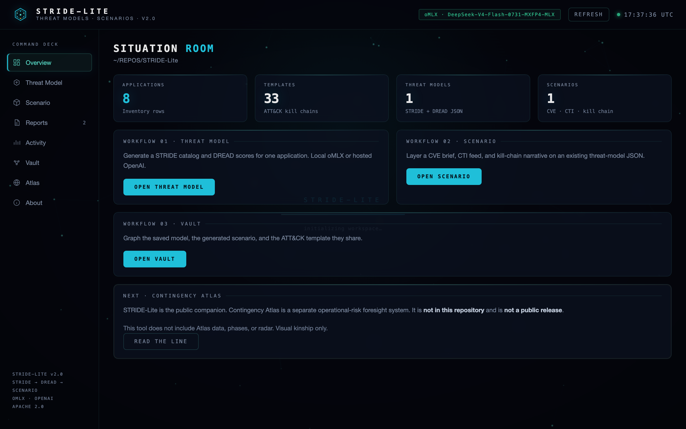
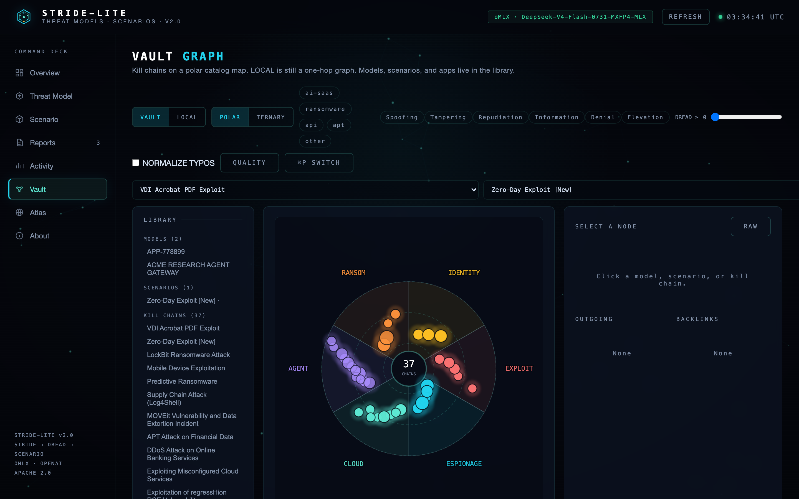
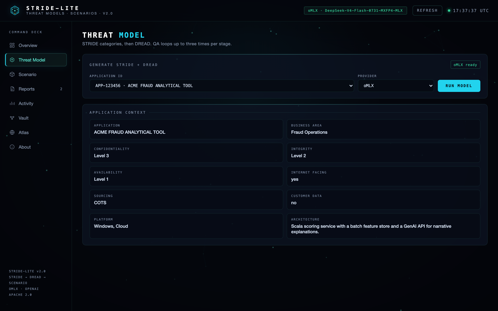
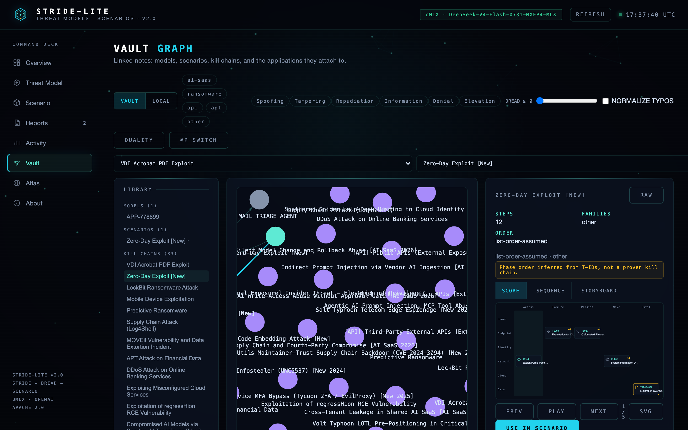

# STRIDE-Lite v2.0

Local STRIDE / DREAD threat models, ATT&CK-templated scenarios, and a linked-note Vault.

Apache License 2.0.

STRIDE-Lite is a **personal research tool**. It is not affiliated with, sponsored, or endorsed by any employer. Outputs are hypothetical artifacts, not advice.

Contingency Atlas is a **separate** operational-risk foresight system. It is **not in this repository** and is **not a public release**. The console look is deliberate kinship, not a bundle.



## What it does

1. **Threat model** — LangGraph workflow: STRIDE catalog, DREAD scores, iterative QA, JSON save.
2. **Scenario** — CVE brief, CTI feed, and a kill-chain narrative on top of a saved model.
3. **Vault** — polar catalog map of kill chains (six slices, radius = data/cloud share; ternary Human/Infra/Data toggle). LOCAL is still a one-hop graph. Compare, quality flags, ⌘P switcher. Kill chains open as a Campaign Score (phase × lane grid, sequence, storyboard).



Inference is OpenAI-compatible. Local oMLX works.

## Requirements

- Python 3.11+
- An OpenAI key **or** a local OpenAI-compatible endpoint
- Optional: Chrome if you want the browser E2E script

## Install

```bash
python3 -m venv .venv
source .venv/bin/activate
pip install -r requirements.txt
```

Or `./setup_and_run.sh`.

```bash
cp .env.example .env
```

Fill in keys. **Never commit `.env`.** `OMLX_*` aliases work. Dashboard or root URLs are rewritten to `/v1`.

## GUI

```bash
python src/python/gui.py
```

Open `http://127.0.0.1:8765`.

| View | Purpose |
|---|---|
| Overview | Counts and workflow entry points |
| Threat Model | Pick an application and generate STRIDE + DREAD |
| Scenario | Pick a saved model + ATT&CK template |
| Reports | Raw JSON library |
| Activity | Job logs |
| Vault | Linked graph, Campaign Score, compare (`#vault`) |
| Atlas | Boundary note: not this repo, not public |
| About | License and limits |





In-browser API check: `http://127.0.0.1:8765/selftest.html`.

## CLI

```bash
python src/python/model.py APP-123456 --provider mlx
python src/python/scenario.py \
  --json_file output/stride/security_assessment_APP-123456_<ts>.json \
  --provider mlx \
  --attack_template "Zero-Day Exploit [New]"
python src/python/score_export.py "Zero-Day Exploit [New]"
```

Optional local inputs (never downloaded):

```bash
# JSON list of {id, description, score, ...}  — or CVE_FEED=...
python src/python/scenario.py --json_file output/stride/....json \
  --cve_feed data/sample_cves.json --attack_template "Zero-Day Exploit [New]"

# ATT&CK STIX 2.x bundle, if you already have one
# ATTACK_STIX=data/enterprise-attack.json
```

Writes `output/stride/`, `output/feedback/`, `output/scenarios/`, `output/diagrams/` (gitignored).

Prometheus metrics default to port **9100** (`METRICS_PORT=0` disables). Do not bind metrics on 8000 — that is the usual oMLX port.

## Tests

```bash
python -m unittest tests.test_stride_lite tests.test_gui_http -v
```

Browser pass (GUI running, `puppeteer-core` + Chrome):

```bash
node tests/e2e_browser.mjs
```

GUI screenshots: GUI running, then `node tests/capture_gui.mjs`.

## Data

| Path | Role |
|---|---|
| `data/applications.json` | Fictional ACME applications (`APP-*` IDs) |
| `data/predefined_attack_templates.json` | ATT&CK technique lists |
| `data/sample_cves.json` | Default CVE feed (one sample). Override with `--cve_feed` or `CVE_FEED` |
| `data/control_taxonomy.csv` | Demo catalog with `SL-01`…`SL-19` IDs invented for this repo |
| `data/enterprise-attack.json` | Optional local ATT&CK STIX 2.x bundle (gitignored, never fetched) |

## Limits

- Scenario QA nodes currently auto-approve. Treat those reports as drafts.
- The default CVE file is one sample record. Point `--cve_feed` or `CVE_FEED` at your own JSON list. No live NVD download.
- ATT&CK names/tactics enrich only if you drop a local STIX bundle at `data/enterprise-attack.json` or `ATTACK_STIX`.
- Some template T-IDs are historically mistyped; Vault flags them instead of silently rewriting the JSON.
- MITRE ATT&CK® IDs are public identifiers used for structure. This project is not affiliated with or endorsed by The MITRE Corporation.

## License

[Apache 2.0](LICENSE).

See [ROADMAP.md](ROADMAP.md) for what is shipped and what is not.
